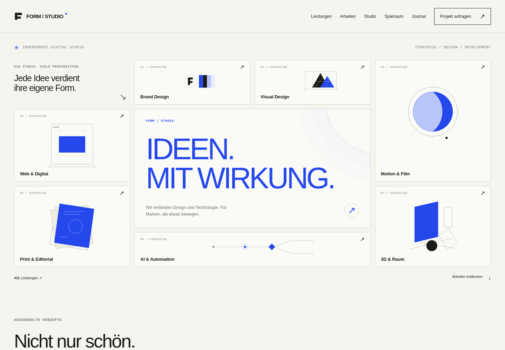

# FORM / STUDIO

**Build a website without writing code. Choose one of ten visual designs. Keep control of your content.**

FORM / STUDIO is an open-source website builder and editorial CMS. Create pages from reusable blocks, manage projects and articles, preview drafts, and publish them through an approval workflow. The public site is server-rendered; JavaScript adds progressive motion and editor interactions. Runs on Python and SQLite without an external service.

**Deutsch:** Erstelle Webseiten ohne Programmierung. Wähle eines von zehn Designpaketen, bearbeite Inhalte im visuellen Studio und veröffentliche sie bewusst. Beiträge, Medien, Rollen, Vorschau und Backups sind enthalten.


<p align="center"></p>

<p align="center"></p>

> The brand, projects, articles and campaign included with the app are **clearly marked demo content**. Replace them before publishing your own site. A public GitHub repository is source distribution, not a hosted instance of the CMS.

## What you can build

- Pages from **20 module types** and **8 starter page templates**, with reusable custom blocks.
- A consistent site-wide look from **10 design packages**: Studio, Noir, Editorial, Atelier, Aurora, Brutalist, Minimal, Garden, Sunset and Terminal.
- A journal with articles, categories, search, RSS and editorial review.
- A contact inbox, media library, revision history, local backups and role-based access.
- Optional, consent-based local analytics and clearly labelled partner placements.

Design packages change presentation across the same content and features. Select a design under **Admin → Einstellungen → Designpaket**, save the draft, then publish the settings. See the [design guide](docs/DESIGNS.md).

## Quick start

Requires **Python 3.11+**. On Windows, extract the archive and run `START-WINDOWS.cmd`. On macOS/Linux, use:

```bash
python3 start.py
```

On first launch, dependencies are installed into `.venv`. Enter the one-time setup key printed in the terminal and choose an admin password of at least 12 characters. The local site opens at `http://127.0.0.1:8000`, with the admin at `/admin`. Node.js is required only to change the TypeScript source.

For manual development setup:

```bash
python -m venv .venv
# Activate .venv for your shell.
python -m pip install -r requirements-dev.txt
python -m pytest tests -q
npm ci
npm run typecheck
npm run build
python start.py --no-bootstrap --no-browser
```

The TypeScript build updates the checked-in browser modules in `app/static/js/`. No runtime Node server, CDN, hosted font or external asset account is needed.

## See the product

| Website | Editor | Modules |
|---|---|---|
|  |  |  |

[Mobile website](docs/website-mobile.png) · [Admin dashboard](docs/admin-dashboard.png) · [All ten design captures](docs/designs) · [Full gallery and animations](docs/HANDBUCH.md)

## Guides

- [Handbuch / user manual](docs/HANDBUCH.md): setup, authoring, design selection, publishing, backup and updates.
- [Design packages](docs/DESIGNS.md): ten styles and how to add another.
- [Architecture](docs/ARCHITEKTUR.md), [security and analytics](docs/SICHERHEIT-STATISTIK.md), [asset provenance](docs/ASSETS.md).
- [Update from v0.1/v0.2](docs/UPDATE.md); never overwrite an existing data directory.
- [Version 0.3 test report](docs/TESTBERICHT.md) and [current release checks](docs/RELEASE-CHECK.md). Test reports describe their exact scope, not a production certification.

## Before hosting a site

Set your own brand and content, replace or unpublish demo pages, and provide your own imprint and privacy text. Use an HTTPS reverse proxy, an exact `SITE_ORIGIN`, `SECURE_COOKIES=1`, protected data storage, tested backups and monitoring. The local starter binds to loopback and is **not** a production deployment guide. This application targets one server instance; its active analytics state is process-local. Inquiries are stored locally and are not emailed automatically.

## Contribute

Ideas, translations, accessible designs, bug reports and pull requests are welcome. Read [CONTRIBUTING.md](CONTRIBUTING.md) and the [code of conduct](CODE_OF_CONDUCT.md). For vulnerabilities, follow [SECURITY.md](SECURITY.md) and avoid public exploit details.

## License and credits

Copyright © 2026 NorphyOG. Licensed under [GNU AGPL-3.0-only](LICENSE). Modified network deployments must provide the corresponding source as the license requires. The visible **Konzept & Entwicklung — NorphyOG** attribution remains part of the demo application; see [creator credit](docs/ERSTELLERHINWEIS.md). The included illustrations were made for this project; see [asset provenance](docs/ASSETS.md).
