# Handbuch

## 1. Start und Einrichtung

ZIP entpacken. Unter Windows `START-WINDOWS.cmd`, sonst `python3 start.py` ausführen. Beim ersten Start den einmaligen Einrichtungscode aus dem Terminal im Adminformular eingeben und ein eigenes Passwort setzen. Das Terminal offen lassen, solange die lokale Website laufen soll. Beenden mit Strg+C.

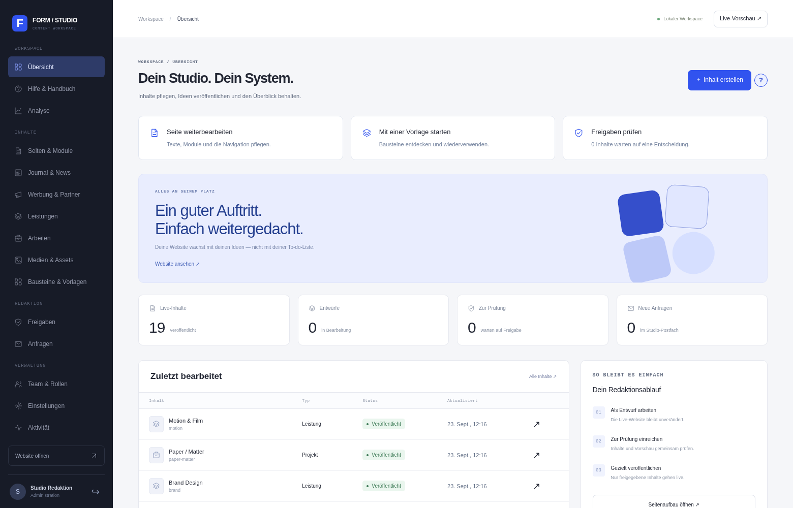

## 2. Eine Seite erstellen

Unter **Seiten → Neu** eine der acht Vorlagen wählen oder mit einer leeren Seite beginnen. Titel und URL-Kennung festlegen, Module hinzufügen und Inhalte eingeben. Die Live-Vorschau zeigt Änderungen vor dem Speichern. **Entwurf speichern** macht die Seite noch nicht öffentlich; erst **Veröffentlichen** schaltet sie frei.

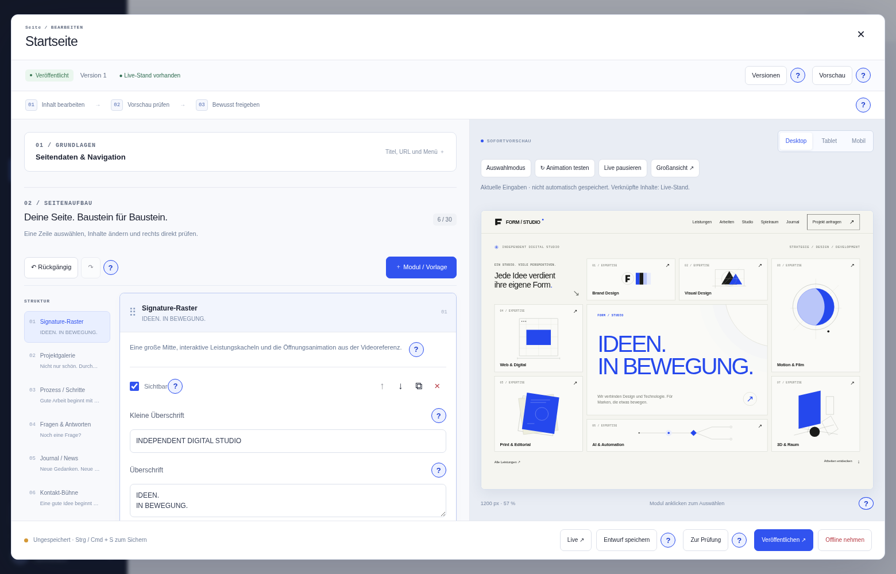

Module: Signature-Raster, Projekte, Prozess, Text, FAQ, Kontakt, Feature-Karten, Bild/Text, Kennzahlen, Zitat, Logos, Preise, Galerie, Trenner, Journal, Werbeplatz, Spotlight, Tabs, Zeitstrahl und Vergleich. Eingefügte Vorlagen sind eigenständige Kopien. Die kleinen blauen `?`-Schaltflächen erklären Eingaben direkt im Studio.

## 3. Eine Oberfläche auswählen

**Einstellungen → Designpaket** öffnen. Eine der zehn Musterkarten anklicken oder das Auswahlfeld nutzen. Danach den Entwurf speichern und die Einstellungen veröffentlichen. Die Änderung gilt für die ganze Website. Die zehn Pakete stehen im [Designleitfaden](DESIGNS.md).

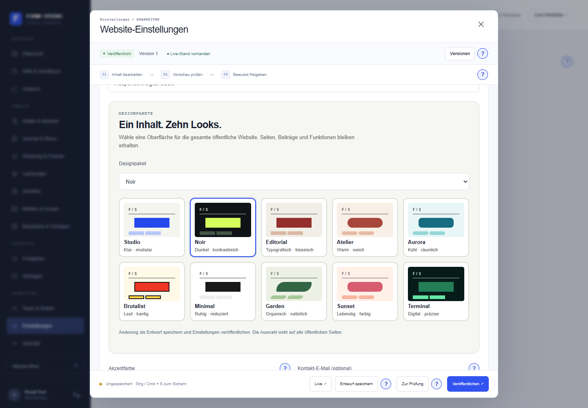

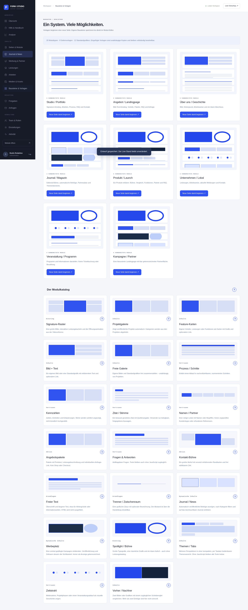

## 4. Beiträge und Medien

Unter **Journal & News** Beiträge mit Autor, Datum, Text und optionalen Modulen anlegen. Entwürfe lassen sich zur Prüfung einreichen. Medien aus der Bibliothek besitzen Alternativtexte; geheime Dateien dürfen nicht hochgeladen werden, da hochgeladene Medien über ihre URL öffentlich sind. Anzeigen bleiben sichtbar als **ANZEIGE** gekennzeichnet.

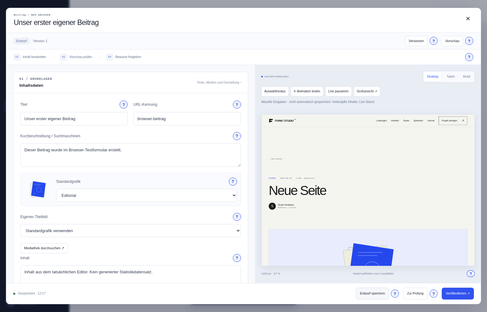

## 5. Kontakt, Statistik und Team

Kontaktanfragen erscheinen im Admin-Postfach; ein E-Mail-Versand ist nicht eingebaut. Lokale Statistik ist standardmäßig aus und benötigt nach Aktivierung die Zustimmung der Gäste. Rollen: Administration, Redaktion und Moderation. Nur berechtigte Personen veröffentlichen Inhalte oder globale Einstellungen.

## 6. Sicherung und Updates

```bash
python scripts/backup.py
python scripts/restore_backup.py /pfad/zum/studio-backup-DATUM.zip
```

Backups enthalten private Daten und gehören geschützt aufbewahrt. Eine Wiederherstellung erfolgt in einen leeren Datenordner. Vor einem Versionswechsel erst sichern, dann [UPDATE.md](UPDATE.md) lesen. Bestehende Datenordner nicht mit Demo-Inhalten überschreiben.

## 7. Veröffentlichung einer eigenen Website

Demo-Marke, Projekte, Artikel, Kampagne und Rechtstexte ersetzen. Für einen Internetbetrieb HTTPS, `SITE_ORIGIN`, sichere Cookies, Zugriffsrechte, Backups und Monitoring einrichten. Der lokale Starter ist für die lokale Nutzung gedacht. Weitere Betriebsgrenzen stehen in [Sicherheit & Statistik](SICHERHEIT-STATISTIK.md).

## Galerie

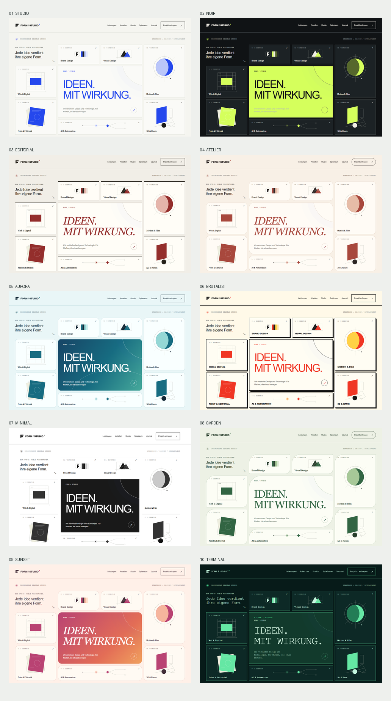
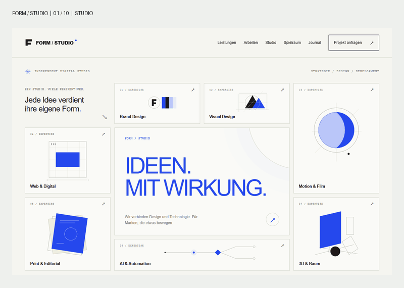
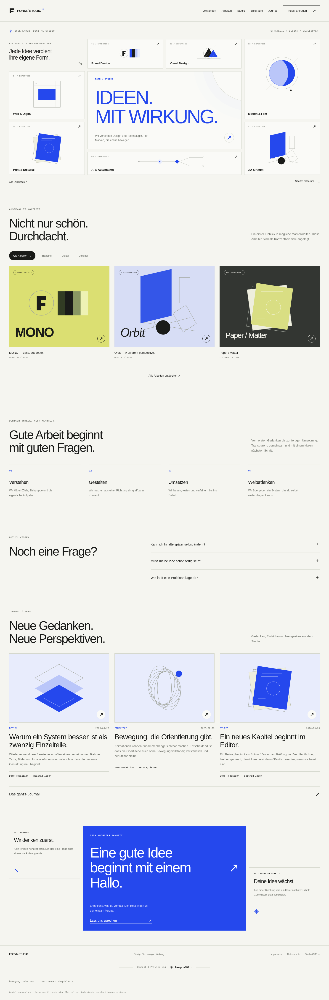
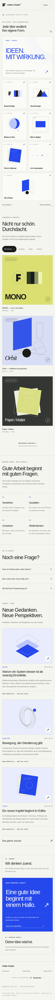
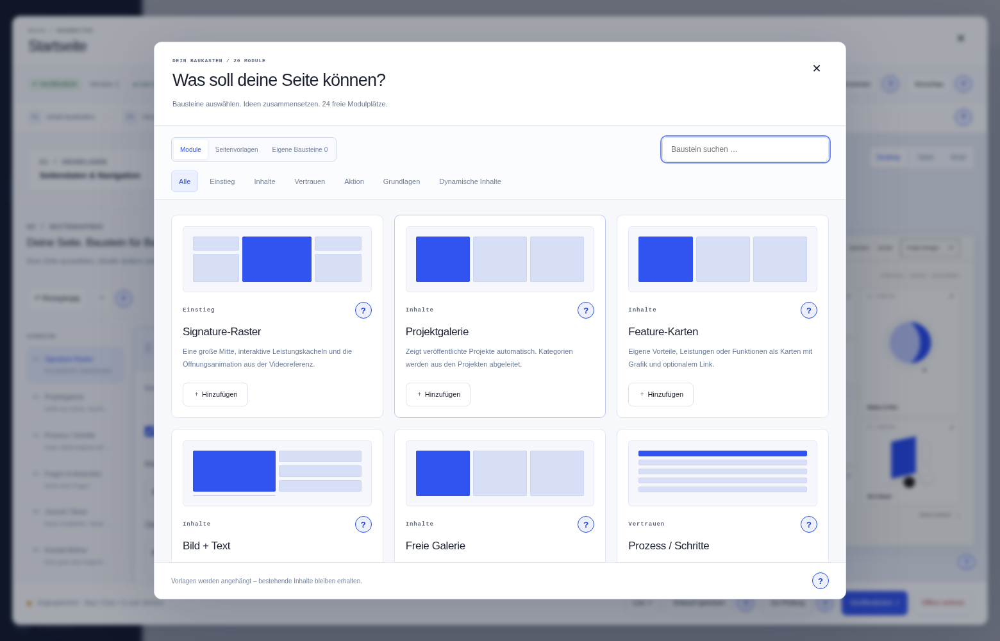
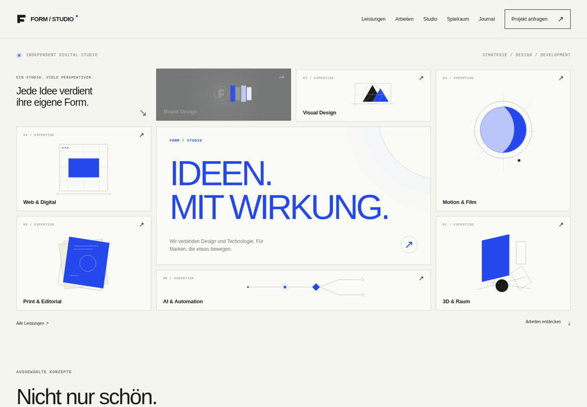

Das HTML-Handbuch [ANLEITUNG.html](../ANLEITUNG.html) enthält zusätzliche interaktive und visuelle Erklärungen aus Version 0.3.
